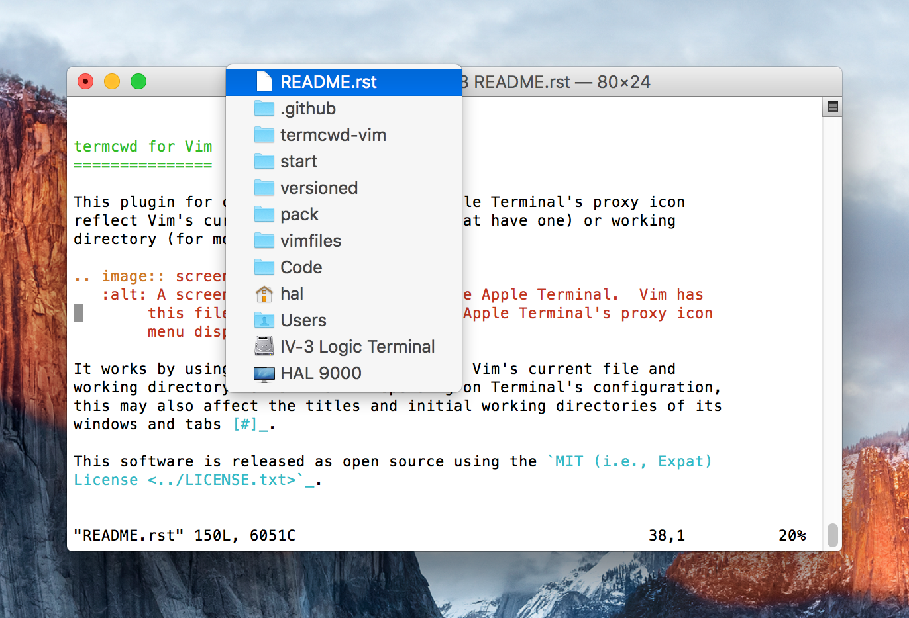

.. .github/README.rst
   ------------------

   SPDX-License-Identifier: MIT

   Copyright 2021 Lawrence Velázquez

   Permission is hereby granted, free of charge, to any person obtaining
   a copy of this software and associated documentation files (the
   "Software"), to deal in the Software without restriction, including
   without limitation the rights to use, copy, modify, merge, publish,
   distribute, sublicense, and/or sell copies of the Software, and to
   permit persons to whom the Software is furnished to do so, subject to
   the following conditions:

   The above copyright notice and this permission notice shall be
   included in all copies or substantial portions of the Software.

   THE SOFTWARE IS PROVIDED "AS IS", WITHOUT WARRANTY OF ANY KIND,
   EXPRESS OR IMPLIED, INCLUDING BUT NOT LIMITED TO THE WARRANTIES OF
   MERCHANTABILITY, FITNESS FOR A PARTICULAR PURPOSE AND
   NONINFRINGEMENT.  IN NO EVENT SHALL THE AUTHORS OR COPYRIGHT HOLDERS
   BE LIABLE FOR ANY CLAIM, DAMAGES OR OTHER LIABILITY, WHETHER IN AN
   ACTION OF CONTRACT, TORT OR OTHERWISE, ARISING FROM, OUT OF OR IN
   CONNECTION WITH THE SOFTWARE OR THE USE OR OTHER DEALINGS IN THE
   SOFTWARE.

termcwd for Vim
===============

This plugin for command-line Vim makes Apple Terminal's proxy icon
reflect Vim's current file (for windows that have one) or working
directory (for most other windows).

        this file open for editing, while Apple Terminal's proxy icon
        menu displays this file's path.

It works by using escape sequences to send Vim's current file and
working directory to Terminal.  Depending on Terminal's configuration,
this may also affect the titles and initial working directories of its
windows and tabs [#]_.

This software is released as open source using the `MIT (i.e., Expat)
License <../LICENSE.txt>`_.

Requirements
------------

- Vim_ 7.2 or later with the ``+autocmd``, ``+eval``, and
  ``+modify_fname`` features.  This can be checked with |Vim's :version
  command|_ or by running ``vim --version`` in a shell [#]_.

  Earlier versions may work, but 7.2 is my baseline.  A few behaviors do
  require newer Vim patches.

  - `Patch 8.0.1459`_ allows updating Terminal immediately `after Vim's
    working directory changes`_ [#stale]_.

  - `Patch 8.0.1596`_ allows updating Terminal `when entering a Vim
    terminal window for the first time`_ [#stale]_.

  - `Patch 8.2.2128`_ allows updating Terminal `before Vim is
    suspended`_ [#]_ and immediately `after Vim resumes`_ [#stale]_.

- Apple Terminal from Mac OS X Lion 10.7 or later |--| i.e., version
  2.2.3 (303.2) or later.  This can be checked from Terminal by choosing
  "About Terminal" from the "Terminal" menu.

.. _Patch 8.0.1459: https://ftp.nluug.nl/pub/vim/patches/8.0/8.0.1459
.. _Patch 8.0.1596: https://ftp.nluug.nl/pub/vim/patches/8.0/8.0.1596
.. _Patch 8.2.2128: https://ftp.nluug.nl/pub/vim/patches/8.2/8.2.2128
.. _after Vim resumes: https://vimhelp.org/autocmd.txt.html#VimResume
.. _after Vim's working directory changes:
   https://vimhelp.org/autocmd.txt.html#DirChanged
.. _before Vim is suspended: https://vimhelp.org/autocmd.txt.html#VimSuspend
.. _Vim's \:version command: https://vimhelp.org/various.txt.html#%3Aversion
.. _Vim: https://www.vim.org
.. _when entering a Vim terminal window for the first time:
   https://vimhelp.org/autocmd.txt.html#TerminalOpen

.. |Vim's :version command| replace:: Vim's ``:version`` command

.. |--| unicode:: U+2014 .. EM DASH

Installation
------------

This plugin has nothing to configure, so just download it and make sure
Vim can find it at startup_.  Here are a few options:

- Clone this repository into a `Vim package`_.  Recommended for Vim 8 or
  later.

  .. code:: sh

     mkdir -p ~/.vim/pack/whatever/start \
         && cd ~/.vim/pack/whatever/start \
         && git clone https://github.com/larryv/termcwd-vim.git

- Use a third-party plugin manager such as `Tim Pope's pathogen`_.  Its
  documentation should explain how to install plugins.  Recommended for
  Vim 7, which predates native package support.

- Clone or download this repository to an arbitrary location and
  manually update |Vim's runtimepath option|_ (perhaps in ``~/.vimrc``).
  Left as an exercise for the reader.  Recommended for my enemies.

That's it.  Enjoy the icon.

.. _startup: https://vimhelp.org/starting.txt.html#load-plugins
.. _Tim Pope's pathogen: https://github.com/tpope/vim-pathogen
.. _Vim package: https://vimhelp.org/repeat.txt.html#packages
.. _Vim's runtimepath option:
   https://vimhelp.org/options.txt.html#%27runtimepath%27

.. |Vim's runtimepath option| replace:: Vim's ``runtimepath`` option

Notes
-----

.. [#] Terminal's `General preferences`_ determine whether new windows
   or tabs open with the same working directory as the current window or
   tab.  Each profile's Window_ and Tab_ preferences determine whether
   windows' and tabs' titles display the name or path of the working
   document or directory.
.. [#] Do not simply look at Vim's welcome screen, as it does not
   provide complete version information.  For example, in the system Vim
   on macOS Mojave 10.14.6 it says "version 8.0.1365", but |:version|_
   says "8.0 [|...|] Included patches: 1-503, 505-680, 682-1283, 1365".
.. [#stale] Even without these patches, Terminal is updated as soon as
   the user switches Vim windows or buffers.
.. [#] Without this patch, Terminal's state becomes stale when Vim is
   suspended, unless the subsequent process updates it.

.. _General preferences: https://support.apple.com/guide/terminal
   /change-general-preferences-trmlstrtup
.. _Tab: https://support.apple.com/guide/terminal
   /change-profiles-tab-preferences-trmltab
.. _Window: https://support.apple.com/guide/terminal
   /change-profiles-window-preferences-trmlwindw
.. _\:version: `Vim's :version command`_

.. |:version| replace:: ``:version``

.. |...| unicode:: U+2026 .. HORIZONTAL ELLIPSIS
